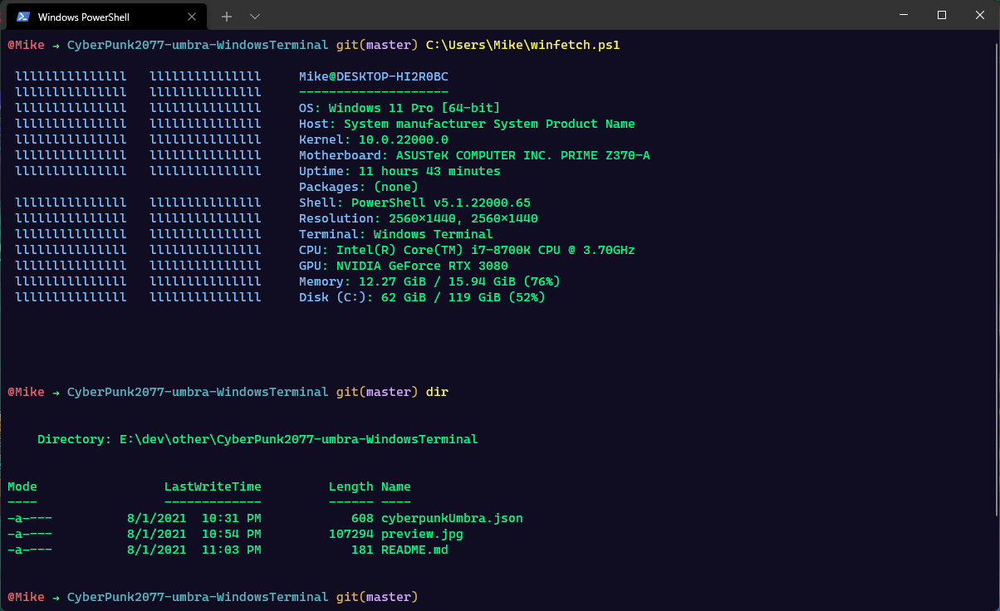

# CyberPunk2077-umbra-WindowsTerminal
Spin off from https://github.com/prometheux-ar/cyberpunk for the Windows Terminal application.

## Installation

Copy the content from [cyberpunkUmbra.json](https://raw.githubusercontent.com/mikevromen/CyberPunk2077-umbra-WindowsTerminal/master/cyberpunkUmbra.json) into your Windows terminal settings.json file into the array under **[schemes]**.

*The default location of the settings.json should be "C:\Users\WIN_USERNAME\AppData\Local\Packages\Microsoft.WindowsTerminal_8wekyb3d8bbwe\LocalState"*